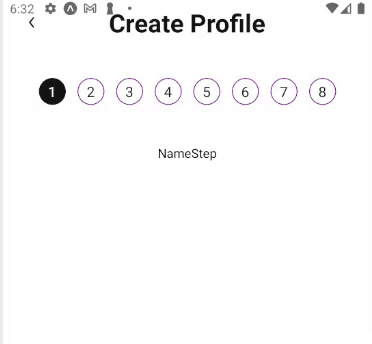

- A react native component of animated dynamic steps view with an animated progress bar, in typescript.

- It comes with a built-in TypeScript typings and is compatible with all popular JavaScript frameworks. You can use it directly or leverage well-maintained wrapper packages that allow for a more native integration with your frameworks of choice.

# Example:



## How to use:

```
import HorizontalGradiantProgressbar from 'react-native-steps-progressbar';

   <HorizontalGradiantProgressbar
        steps={steps}
        currentStep={currentStep}
        containerStyle={{height: 10}}
        gradiantStyle={{borderRadius: 50}}
        colorPrimary={GlobalColors.Brand.primary}
        colorSecondary={GlobalColors.Brand.secondary}
      />
```

# CountryCodePicker Props -

| Name                    | Type        | Default |
| ----------------------- | ----------- | ------- |
| containerStyle          | ViewStyle ? |
| gradiantStyle           | ViewStyle ? |
| colorPrimary            | string      |
| colorSecondary          | string      |
| steps                   | number      |
| currentStep             | number      |
| stepSize                | number ?    |
| stepTextStyle           | TextStyle ? |
| stepSelectedViewStyle   | ViewStyle ? |
| stepUnSelectedViewStyle | ViewStyle ? |
| stepSelectedTextStyle   | ViewStyle ? |
| stepUnSelectedTextStyle | ViewStyle ? |
